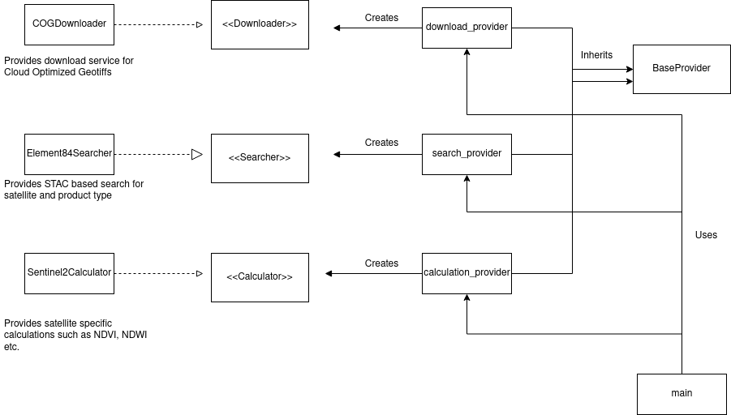

## Satellite Image Explorer and Processor (SIEP)


[](https://www.gnu.org/licenses/gpl-3.0)

SIEP allows users to search satellite scenes with specific filtering criteria and use the scenes with the processors to make the mathematical computations for scientific purposes.

SIEP is an extendable system that currently has implementations for the L2A product of Sentinel-2. It uses API built with STAC specification (for now Element84 API only) for searching and currently calculates NDVI, NDWI, and the general statistics of those indices.

### Use Cases

Users can use the tool to compute NDVI, NDWI and generate statics of those indices. The NDVI allows users to monitor vegetation, while NDWI enables users to monitor water content. These indices could be used separately or in conjunction for different applications such as flood detection, deforestation detection, vegetation health, etc.

### Installation and Using Tool

The tool has been tested in python 3.9. Therefore it is advisable. However, the libraries used should also work with python 3.6 onwards. Users cna install the tool by directly installing this package via pip as follows:

```bash
>> pip install git+ssh://git@github.com/Geosynopsis/SatProcessor.git
```

or if you would like to make use of the conda-environment file prepared by the author, you could clone and install as follows:

```bash
>> git clone git@github.com:Geosynopsis/SatProcessor.git
>> cd SatProcessor
>> conda env create -f conda-env.yaml
>> conda activate SatProcessor
>> python setup.py install
```

### Using from the script

Users can use each component individually or could directly call a script for the computations.

#### Searching Satellites Images:

```python
from datetime import datetime
from SIEP.searcher import search_provider

# Searchers are registered to provider in name `satellite_product` like `sentinel-2_l2a`. It's temporarily so, it could be subject to the change in future

async def search():
    bbox=[-180.-90,180, 90]
    start = datetime(2020, 1, 1)
    end = datetime(2020, 2, 1)
    provider_name = f"sentinel-2_l2a"
    searcher = search_provider.get(provider_name)
    result = await searcher.search_items(bbox, start, end):
    for item in result.items:
        print(item)

```

#### Downloading Satellite Images

```python
from datetime import datetime
from SIEP.downloader import download_provider

# item generated via search or pystac.Item object. It must consist of assets
async def download(item, assets=["B04","B05"]):
    provider_name = f"sentinel-2_l2a"
    downloader = download_provider.get(provider_name)(item)
    return await downloader.download(assets=assets, gjson="overlapping geometry in geojson format")

```

#### Computing Indices

> Since we have built this tool for utilizing the capability of COG and reducing the local copies of data, we made the computation to use the downloader to access the data when needed directly.  

```python
from datetime import datetime
from SIEP.calculator import calculation_provider

async def compute_ndvi():
    provider_name = f"sentinel-2_l2a"
    calculator = calculation_provider.get(provider_name)(downloader) # The downloader created before
    return await calculator.compute('ndvi', calculator)

```

### Using with CLI

Users can use the tool after installation by directly accessing the script or via cli as follows: 

```bash
>> siep -s sentinel-2 -p l2a -g ./doberitzer_heide.geojson -i ndvi -i ndwi
```

### Design Detail

During the system's design, we were mindful of the system's modularity and ease of extension in the future. However, it makes some assumptions that are core to the strategy:

> The search is a client implementation of API with STAC specification. One can integrate another type of API using an adapter that maps the results to the Collection, ItemCollection, Item, and Asset types of STAC.

> The region of interest must always be available and should be within the extent of a single image. In the future, we will have to find a better way of handling the ROI spanning over multiple image tiles.

The system implementation consists of three different significant components `Searcher`, `Downloader`, and `Calculator`. The searcher is responsible for search while the downloader for downloading data and the calculator for operations on the data. Since the search, data access model, and operation depend on different factors such as the satellite mission, product type, distribution format of files, etc., separate implementations of those components are developed and provided through factories to limit coupling.

A high-level UML diagram of the system looks as such:



### Tests

We have tested each component of the system for correct behavior as well as expected exceptions. Please report to us if you see the potential to strengthen the system further.
The test plan we adopted for this system is as follows:

* Unit test each component
* Integration test of whole user interaction flow with different input configurations

### Outlook

* Adding support for more satellites and products
* Adding downloader for non COG files as well
* Support download without area as well
